The EK Agency website is a website for a marketing agency. It is made for companies looking for marketing services. EK Agency offers all sorts of marketing services to both big and small companies. 

The user of the home page is able to read about the services offered and read testimonials from clients. The users of the contact page are able to contact the agency through a contact form, but also see company details and access the EK Agency’s social media accounts. 

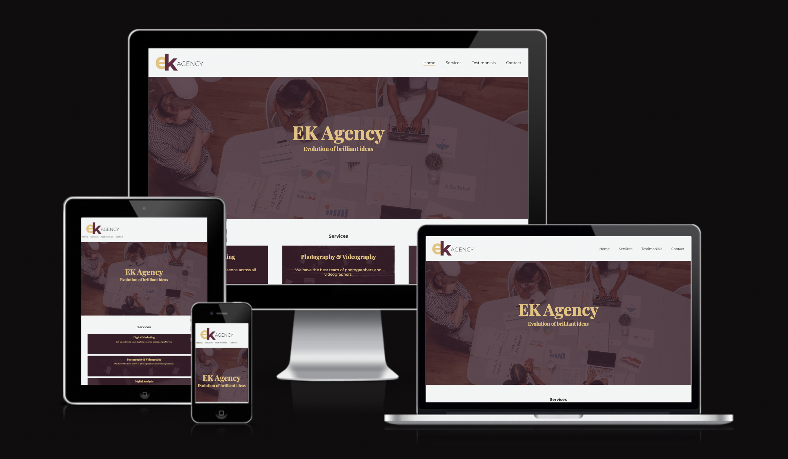
  

**User Stories**
* As a user of the website, I would like to know more about the services EK Agency offer. Therefore, I click on the "services" link in the navbar, which sends me to the services section of the page. Here, I can read about the services offered.
* I would also like to read testimonials from previous clients. Therefore, I click on the "testimonials" link in the navbar, which sends me to the testimonials section of the page. Here, I can read testimonials from previous customers. 
* As a user of the website, I would also like to contact the company. Therefore, I click on the "contact" link in the navbar, which sends me to a contact page. Here, I can fill out a form to contact the company, and I can also see where the company is located by looking at the google maps under the form. 

**Features**

<em>Header & Navigation</em>

<ul>
<li>You find the brand logo at the top of the page to the left which links to the home page.</li>
<li>At the top of the page, you find the menu links. These are Home, Services, Testimonials and Contact.</li>
<li>Services and Testimonials both link to different sections of the home page.</li>
<li>Contact links to a different page of the website; contact.html.</li>
<li>The page which is currently active is shown with an orange bottom border, making it easy for the user to see where on the page they currently are.</li>
</ul>

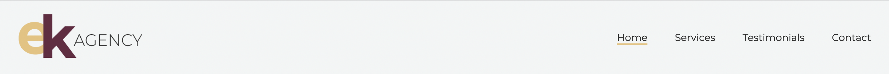
  
<em>Hero section</em>
<ul>
<li>The hero section is covered with a picture, showing a marketing team, which is fitting for a marketing agency. </li>
<li>The hero image has a dark mulberry purple overlay, to match the color of the logo and the brand’s graphic profile. </li>
<li>The hero sections has two headers. H1 is the company name, partly for SEO purposes, and H2 is a description of the website/company, so that the user easily know what the website is for.</li>
</ul>

  
<em>Services section</em>
<ul>
<li>This section showcases the different services EK Agency has to offer</li>
<li>The colors follow the graphic profile of mulberry purple and yellow, with purple overlays to the pictures with yellow text.
<li>The images of all services boxes matches the service provided (for example, for the Photography & Videography box you can see a photo studio). 
<li>You can easily see what services are provided through the heading, and also read a short description of the service.
</ul>
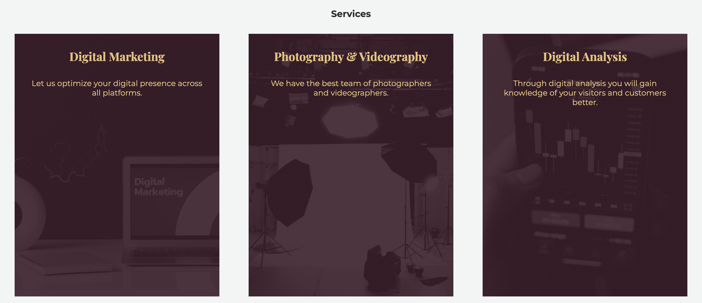

  
<em>Testimonial section</em>
<ul>
<li>In the testimonial section, you can read testimonials from previous or current clients.</li>
<li>The images have a border in yellow, again to follow the graphic profile of EK Agency and improve the visual design through coherence. </li>
</ul>
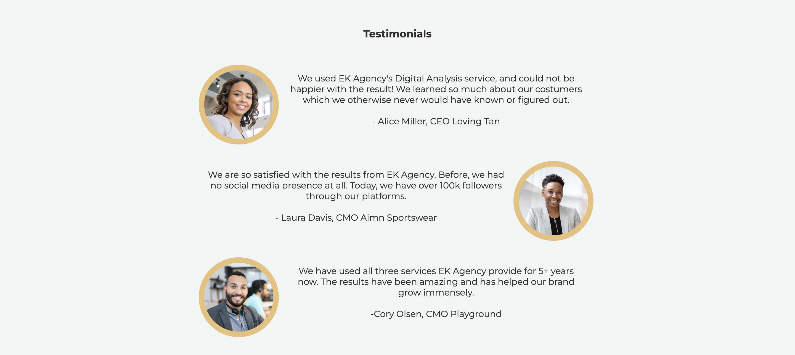

  
<em>Footer</em>
<ul>
<li>In the footer to the left, you can find the contact information for the company</li>
<li>Social media links are places on the right side of the footer</li>
<li>All links will open in a new tab for a good user experience</li>
</ul>
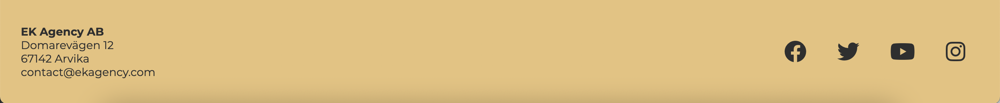

  
<em>Contact form</em>
<ul>
<li>The contact form’s function is for website users to easily be able to contact the company</li>
<li>The form collects the users First name, Last name, email adress and answers the question if the user is an existing customer. </li>
<li>The user has the option to write their question in the textarea. </li>
<li>All fields are required except for the textarea. </li>
<li>The email field is set to email, so that the user has to enter an email address in the field.</li>
</ul>
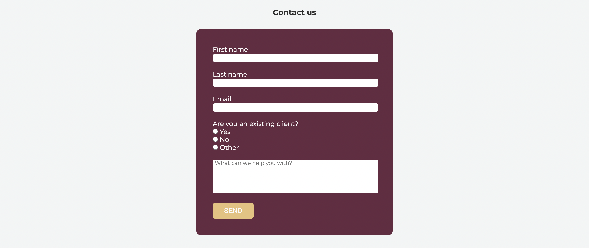
When submitting the form, the user will be redirected to a confirmation page with a message. Here, the user can easily navigate back to the home page by pressing a link. 
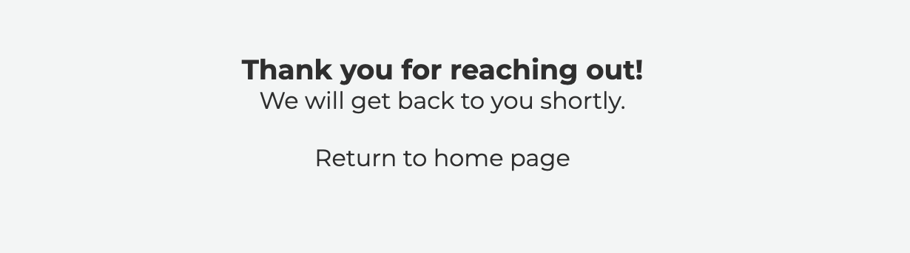

  
<em>Map</em>
<ul>
<li>The contact page also has a google maps provided so that the user easily can see where the agency is located</li>
</ul>
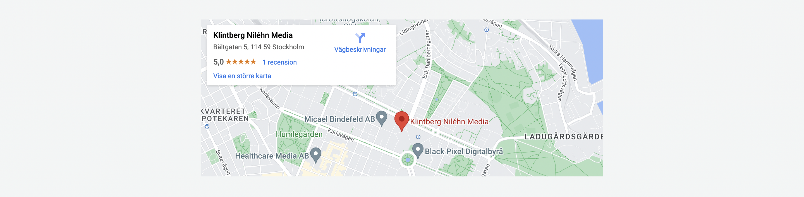

  
**Future features**
<ul>
<li>The services section could be improved by making the images more visible. As per today, the images are barely visible as I chose to prioritize the description being easy to read by using a heavy overlay. This could be solved by only showing the text header, and then provide more information about the service when the user hovers over the service while increasing the opacity of the overlay. Example shown below:</li>
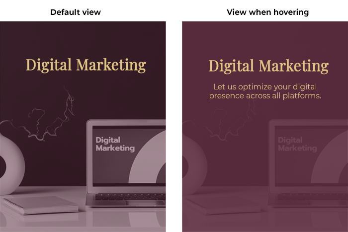
<li>As per today, the service boxes are enlarged when hovering. Future features could include linking the boxes to other pages of the website, explaining the services further and providing examples.</li>
</ul>
  

**Wireframes, typography and color scheme**

*Wireframe*
 
Sketch of the website:
 
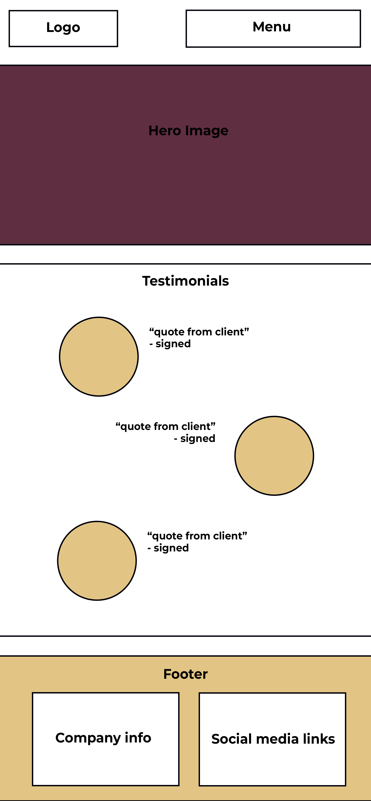
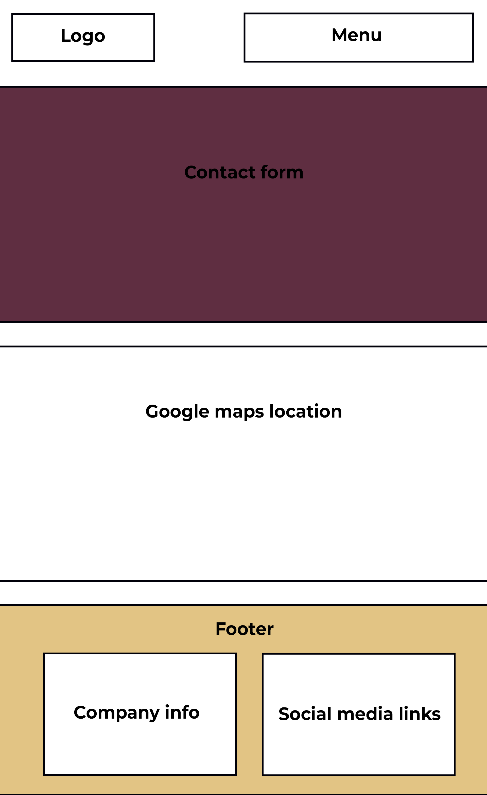
  
<em>Typography & color scheme</em>
 
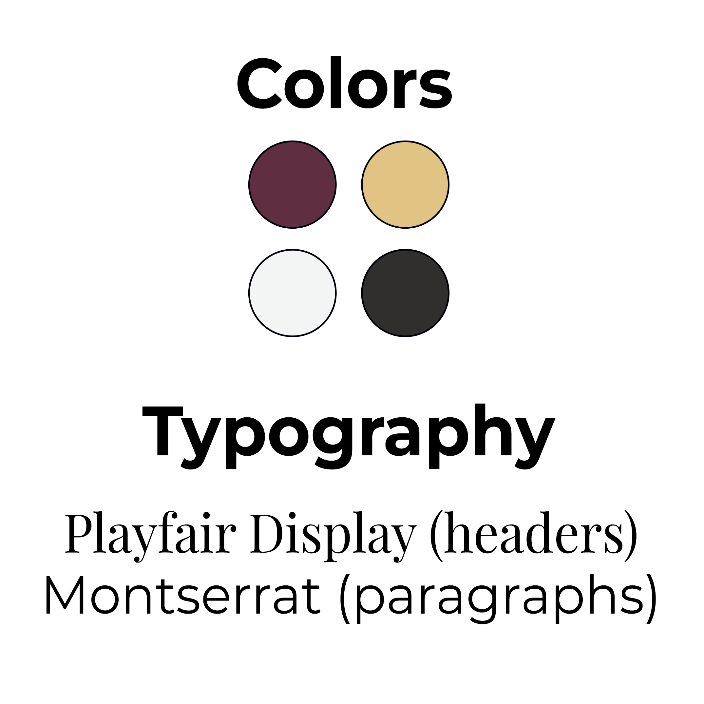
 
<ul>
<li>Playfair Display are used for headers</li>
<li>Montserrat are used for paragraphs and links</li>
<li>Colors chosen are #e2c484 (yellow), #5f2e41 (purple), #f3f5f5 (light gray), #302f2e (dark gray)</li>
</ul>
  

**Technology**
<ul>
<li>HTML - I have used HTML to write the code</li>
<li>CSS - I have used CSS to style and design the page</li>
<li>Font awesome - I have used Font Awesome for icons in the footer</li>
<li>Google Fonts - I have used Google Fonts to access the two fonts used on the webpage</li>
<li>GitHub - I have hosted the platform through GitHub</li>
<li>GitPod - I have used GitPod to write the code</li>
</ul>
  

**Testing**
<ul>
<li>I made sure all sections of the website are easy to understand and read.</li>
<li>I confirmed that the form works - the input fields which are required works and won't let you submit if not filled out, the email field only accepts an email address and the submit button works.</li>
<li>I have checked to make sure the website is responsive and works on desktops, tablets and mobile devices.</li>
<li>I confirmed the website works in different browsers (Chrome, Firefox and Safari)</li>
</ul>
  

*Test cases*

- Contact form:
    1. User clicks on "contact" link in navbar, user gets directed to contact page.
    2. User try submitting the contact form without putting in first name, last name, email address and does not select an option under the "Are you an existing client" question, submission fails.
     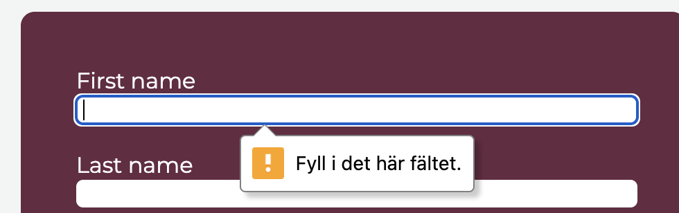
    3. User puts in first name and tries to submit again, submission fails.
     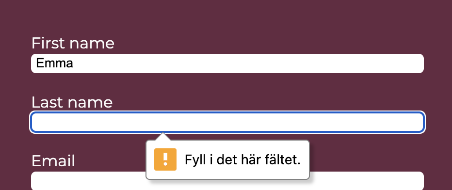
    4. User puts in last name and tries to submit again, submission fails.
     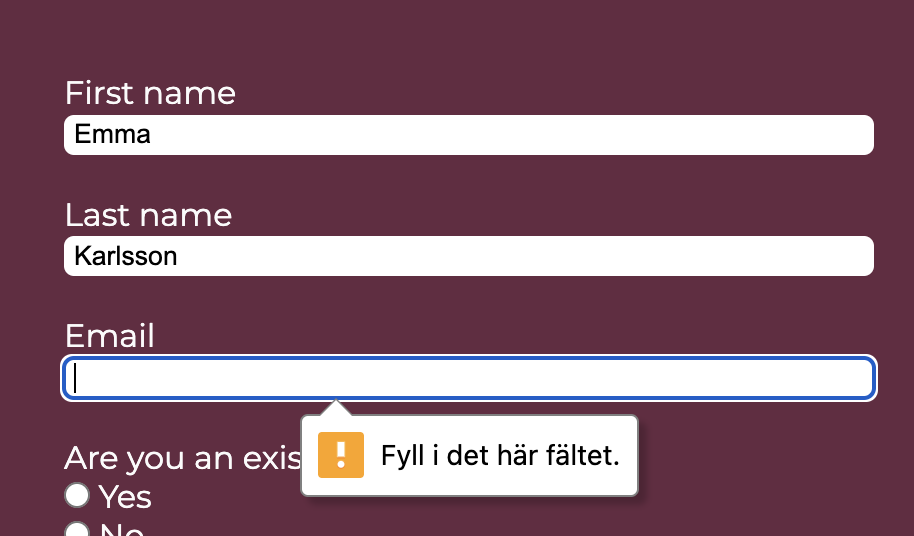
    5. User puts in text in the email field which is not an email address, submission fails.
     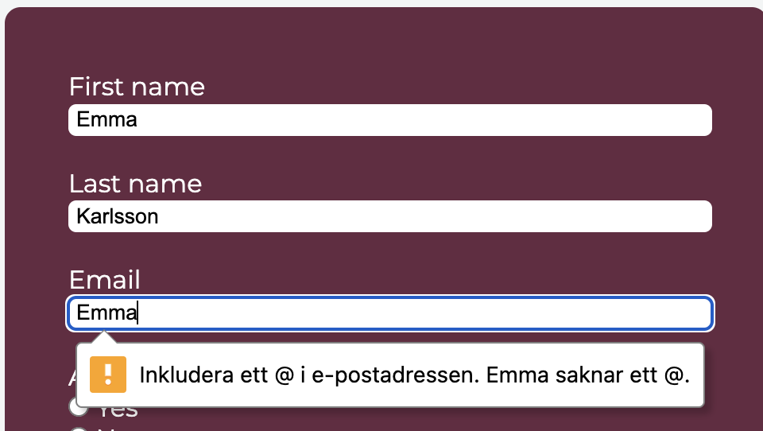
    6. User puts in a correct email address and tries to submit again, submission fails. 
     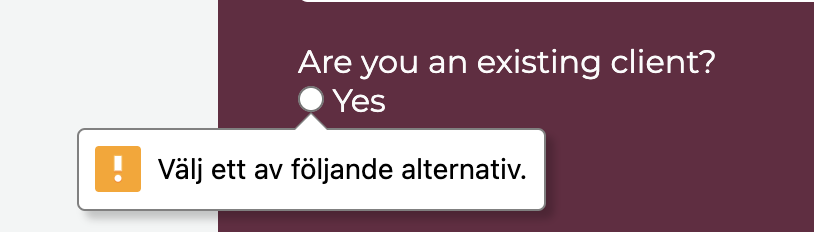
    7. User chooses an option under the "Are you an existing client" question and tries to submit again, submission succeeds and user is sent to the confirmation page. 
     
  
- Confirmation page: 
    1. User tries to go back to home page
    2. User clicks the "return to home page" link.
    3. User is sent back to home page.
  
- Services section:
    1. User tries to read about services.
    2. User clicks the "services" link in navbar.
    3. User is sent to services section and is able to read about the different services.
  
- Testimonials section: 
    1. User tries to read testimonials from previous clients.
    2. User clicks the "testimonials" link in navbar. 
    3. User is sent to the testimonials section and is able to read testimonials from different clients. 

**Bugs**
<ul>
<li>When I first tried styling the testimonial-boxes, nothing would change. I then noticed that in my CSS file, I had written "#testimonial-boxes" when testimonial-boxes was actually a class. I changed this to ".testimonial-boxes" and was able to style them.</li>
</ul>
  

**Validator testing**
<ul>
<li>HTML - The website passed without warnings or errors when checked through the W3C validator.</li><a href="https://validator.w3.org/nu/?doc=https%3A%2F%2Femmavkarlsson.github.io%2Fportfolio-project1%2Findex.html">Results home page.</a><a href="https://validator.w3.org/nu/?doc=https%3A%2F%2Femmavkarlsson.github.io%2Fportfolio-project1%2Fcontact.html"> Results contact page.</a> <a href="https://validator.w3.org/nu/?doc=https%3A%2F%2Femmavkarlsson.github.io%2Fportfolio-project1%2Fconfirmation.html"> Results confirmation page.</a>
<li>CSS - The website passed without warnings or errors when checked through the Jigsaw validator.</li><a href="https://jigsaw.w3.org/css-validator/validator?uri=https%3A%2F%2Femmavkarlsson.github.io%2Fportfolio-project1%2Findex.html&profile=css3svg&usermedium=all&warning=1&vextwarning=&lang=sv">Results.</a>
<li>Accessibility - the website scored high in all areas when tested through the Lighthouse function in devtools.</li>
</ul>
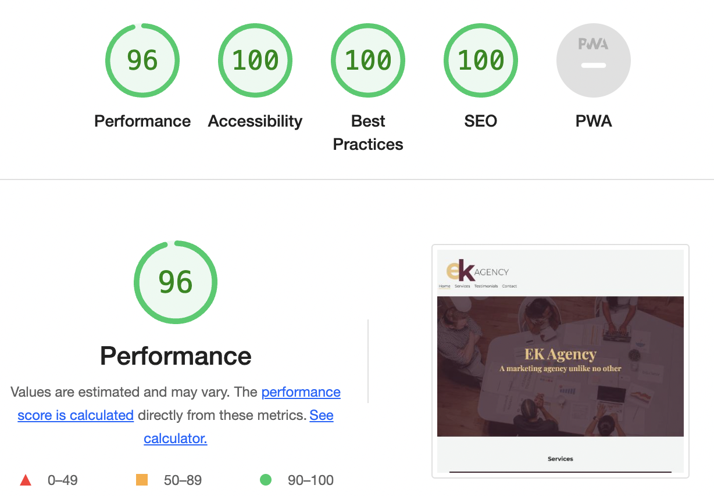
  

**Deployment**
* The site was deployed to GitHub pages through the following steps:
    1. Open the repository and go to Settings.
    2. In the menu to the left, press Pages.
    3. Under Branch, select Main.
    4. The link to the website is then provided at the top of the page.
* The site was deployed to GitPod through the following steps:
    1. Open the repository and press the green "GitPod" button.
    2. In the terminal, write "python3 -m http.server" and press enter
    3. A pop up will appear at the bottom right, press "Open Browser"
    4. The page will open in a new tab.
  

**Credits**

*Content* 
Social media links were taken from the Love Running project

*Media*  
All images on the website are taken from Pexels.  
Hero image <a href="https://www.pexels.com/sv-se/foto/marknadsforing-manniskor-kontor-arbetssatt-7688336/">link</a>
 Services - digital marketing <a href="https://www.pexels.com/sv-se/foto/bord-dator-dekoration-enhet-6483582/">link</a>
 Services - photography & videography<a href="https://www.pexels.com/sv-se/foto/lampor-kamera-arbetssatt-fotografi-134469/">link</a>
 Services - digital analysis<a href="https://www.pexels.com/sv-se/foto/marknadsforing-hand-smartphone-internet-7567441/ ">link</a>
 Testimonial picture 1<a href="https://www.pexels.com/sv-se/foto/man-kostym-manniskor-kvinna-1367269/">link</a>
 Testimonial picture 2<a href="https://www.pexels.com/sv-se/foto/kvinna-kontor-foretag-rum-2381069/">link</a>
 Testimonial picture 3<a href="https://www.pexels.com/sv-se/foto/man-kontor-leende-professionell-8204402/ ">link</a>

